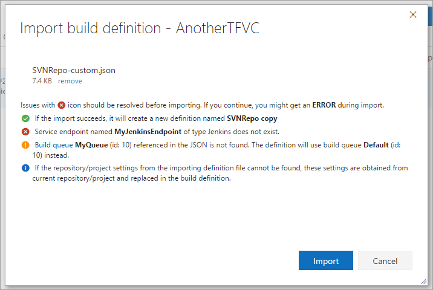
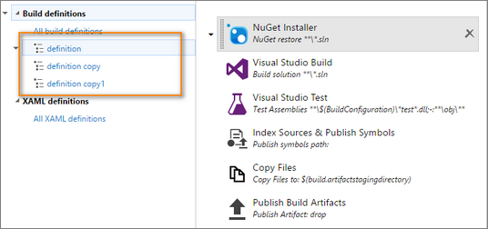

 

## Release notes ##

> **Feb 2017**
> - Additional validations of JSON file before importing.
> - The extension now checks existence of service endpoints before importing.
> - UI changes to Import dialog, code cleanup and refactor.
> - Disable analytics and trust customers will report issues :-)
> - Remove preview flag.
> - Uses latest version of typescript.

> **Aug 2016**
> - Improved the import logic - *If the project/repository/service endpoint from the file cannot be found (in the importing project) extension tries to first resolve from the first available build definition. Extension will throw error only when it cannot find the definition too.*
> - Minor changes to UI style

> **Jun 2016**
> - Initial version (`preview`)

**This extension will help you to export your build definition and then import it in same or another team project or even different collection/account!**

Thus helping you to
 - Version control your definitions (exported file is JSON which can be checked in as any other file).
 - Avoid manually duplicating the definition in another team project/account.
 - No need to manually add steps and set their values.
 - The extension also highlights any missing service endpoints.

## Get Started ##

> **Note:** The extension only supports new (non XAML) build definitions.

Once you install the extension, go to `Builds` hub and right-click on any build definition. You will see a two new menu items `Export` and `Import`.

### Export build definition ###

- Right-click and click `Export` on the build definition you would like to export.
- You will be prompted save the definition as a file.
- Save the file with JSON extension.

### Import build definition ###

- Right click on any existing build definitions and click on `Import`
- You will be prompted to upload a build definition file.
- You can either drag and drop a file or use the `Browse` button to select the file you want to import.
- Once you upload the file, the file will be parsed and the dialog will highlight you if any issues with the definition.

  

- Click `Import`. If import is successful, you will have your build created, with all your steps, variables, schedules and other build definition parameters.

## Limitations/Known issues

1. Known issues
	- If you are on on-premise TFS (including TFS 15 RC1), `Export` and `Import` menu items only appear on build definition context menu and do not appear on `All build definitions` context menu.
	- If you do not have any existing build definitions, you need to create a temporary empty build definition to see these menu items.
2. You might get an error when you are importing a build definition and,
	- Repository/project settings from import file do not match the project in which you are importing.
	- Import file has build step from custom extension and you do not have extension installed on the importing project.
	- Import file has service endpoints which do not exist in importing project.

## Report Issues
Found an issue or want to suggest a feature? Add them at [http://bit.ly/exportimportbuildissues](http://bit.ly/exportimportbuildissues)